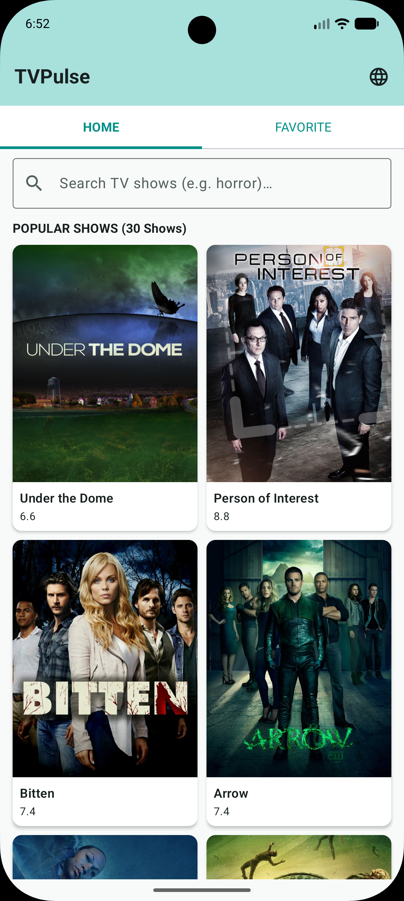
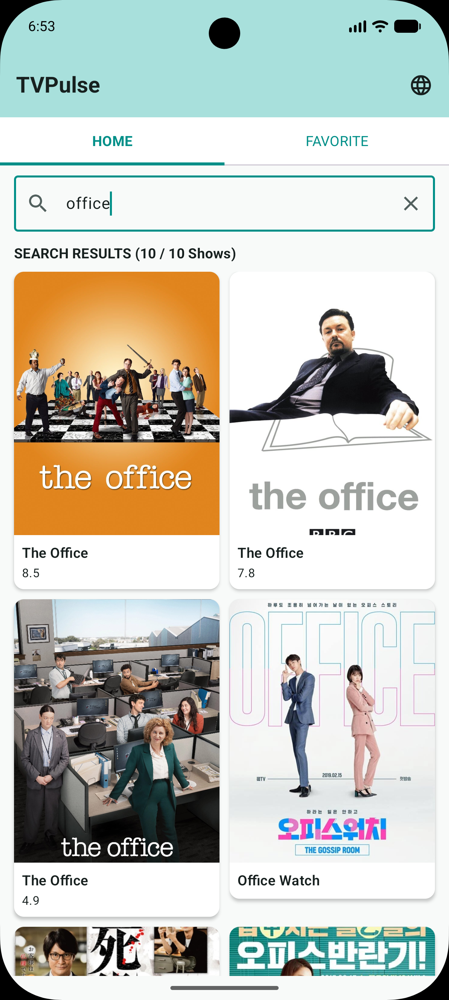
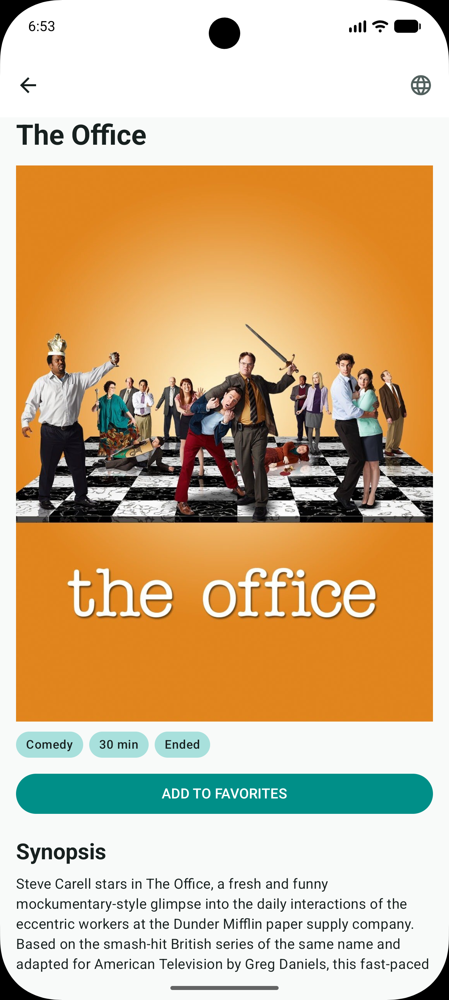
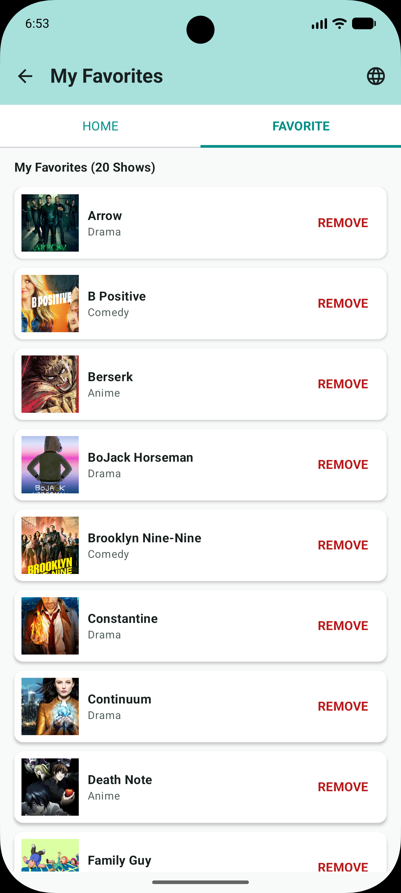

# TVPulse

TVPulse is an Android app for browsing TV shows using the public [TVmaze API](https://www.tvmaze.com/api).

I built this project with Kotlin and Jetpack Compose. The main focus is not only showing data from the API, but also handling real app cases such as offline data, pagination, synchronization, image loading errors, favorites, localization, and navigation.

## Screenshots

<p align="center">
  
  
  
  
</p>

## Features

- Browse TV shows from TVmaze.
- Home pagination with **30 items per batch**.
- Search with a **350 ms debounce**.
- Search results are limited to **10 items**, following the TVmaze search API limit.
- Add and remove favorite shows.
- Favorites are stored locally and can be used offline.
- Favorite metadata is synchronized with TVmaze so information such as the title, image, genre, rating, and status can stay updated.
- Favorites are paginated locally and each newly visible page can synchronize its show metadata.
- Offline-first data flow using Room as the source of truth.
- Cached data is shown immediately while newer data is synchronized in the background.
- Retry button for failed network images.
- Indonesian and English app languages.
- Connection error handling with retry.
- Custom-scheme deep links for Home, Search, Favorites, and Detail.
- Consistent in-app back navigation animation.

## Offline-first

The app uses Room as the source of truth for UI data.

The UI does not need to wait for the network when cached data is already available.

```text
TVmaze API -> Repository -> Room -> ViewModel -> Compose UI
```

The basic behavior is:

| Local data | Network state | What the user sees |
| --- | --- | --- |
| No cache | Loading | Loading indicator |
| No cache | Failed | Error state and retry |
| Cache exists | Syncing | Cached data and sync indicator |
| Cache exists | Success | Updated data from Room |
| Cache exists | Failed | Cached data stays visible |

This means a temporary network problem does not remove data that is already available offline.

## Home

Home loads data from Room first.

If there is no local data yet, the app shows a loading state while fetching data from TVmaze.

When cached data already exists, it is shown immediately while the app checks the server for newer data.

Home uses pagination with **30 visible items per batch**.

```text
30 items -> Scroll -> 60 items -> Scroll -> 90 items
```

TVmaze `/shows?page={page}` is used to fetch more remote data when the local cache does not have enough items.

## Search

Search is part of the Home screen instead of a separate navigation destination.

The query uses a **350 ms debounce** so the app does not send a request for every key press.

Search is also offline-first:

1. The app checks cached results in Room.
2. Cached results can be shown immediately.
3. The app synchronizes the same query with TVmaze when possible.
4. New results are saved back into Room.

TVmaze's `/search/shows` endpoint returns a maximum of **10 search results** and does not provide a normal next-page API. Because of that, TVPulse intentionally does **not** create fake search pagination.

The UI shows the maximum clearly instead.

```text
SEARCH RESULTS (10 / max 10 Shows)
```

## Favorites

Favorite membership is local app data.

TVmaze does not store which shows the user has favorited in TVPulse, so adding or removing a favorite only changes local Room data.

However, the **show metadata inside a favorite can change on the server**.

For example:

- the title can change;
- the poster can change;
- genres can change;
- rating can change;
- status can change.

Because of this, the app keeps the favorite membership local while synchronizing the latest show metadata from TVmaze.

```text
Favorite membership -> Room (local only) -> Favorite Show Metadata (Cached in room & Refreshed from TVmaze)
```

Favorites are shown in local batches. When another favorite page becomes visible, that page can synchronize its metadata without reloading the entire favorite list.

## Detail

The Detail screen receives only a `showId`.

It then loads the show through the repository instead of passing a full `TvShow` object through navigation.

If the show is already cached, Detail can show it immediately and refresh it in the background.

The poster keeps its original aspect ratio instead of being forced into a fixed-height crop.

## Image loading

Network images use a shared retryable image component.

While an image is loading, the UI shows a loading indicator.

If loading fails, the image area shows a clickable retry icon.

```text
Loading -> Image or Loading -> Error -> Tap Retry -> Loading again
```

This behavior is used for network images across the app, not only on Home.

## Error handling

A network error is handled differently depending on whether the app still has usable cached data.

### No cached data

The app shows an error state because there is nothing else to display.

The connection dialog provides:

- **Close** -> closes the dialog.
- **Try Again** -> closes the dialog, returns to loading, and starts the request again.

### Cached data exists

The cached data stays visible.

A background synchronization failure is treated as a non-blocking problem instead of replacing the whole screen with an error.

An empty search result or an empty favorite list is also treated as a normal empty state, not as a connection error.

## Language

TVPulse supports:

- Indonesian
- English

The app uses Android per-app locales, so the selected app language is handled through the Android locale system.

Text returned directly by TVmaze, such as show titles and synopsis content, is not translated by the app.

## Navigation

The app uses Navigation 3 with typed destinations:

```text
HomeDestination
FavoritesDestination
DetailDestination(showId)
```

The system Back button and the Back button inside the app use matching in-app transition behavior.

When Back is pressed from the root Home screen, Android can still use its normal system animation for leaving the app.

### Custom deep links

TVPulse supports custom-scheme deep links using:

```text
movieapp://
```

Supported routes:

| Screen | Deep link                    |
| --- |------------------------------|
| Home | `movieapp://home`            |
| Search | `movieapp://search?q=office` |
| Favorites | `movieapp://favorites`       |
| Detail | `movieapp://detail/42`       |

Search is still part of the Home screen. Opening a Search deep link opens Home and applies the query.

You can test the deep links with ADB.

Home:

```bash
adb shell am start -W \
  -a android.intent.action.VIEW \
  -d "movieapp://home" \
  com.kelvinsaputra.tvpulse
```

Search:

```bash
adb shell am start -W \
  -a android.intent.action.VIEW \
  -d "movieapp://search?q=office" \
  com.kelvinsaputra.tvpulse
```

Favorites:

```bash
adb shell am start -W \
  -a android.intent.action.VIEW \
  -d "movieapp://favorites" \
  com.kelvinsaputra.tvpulse
```

Detail:

```bash
adb shell am start -W \
  -a android.intent.action.VIEW \
  -d "movieapp://detail/42" \
  com.kelvinsaputra.tvpulse
```

These are custom-scheme deep links, not verified Android App Links. A production App Link would normally use an HTTPS URL and domain verification.

## Architecture

The project uses a simple Clean Architecture structure.

```text
UI -> ViewModel -> Use Case -> Repository Interface -> Repository Implementation (Room or Retrofit)
```

The main layers are:

- **UI** : Jetpack Compose screens and UI state.
- **ViewModel** : handles screen state and user actions.
- **Domain** : models, repository contracts, and use cases.
- **Data** : Room, Retrofit, DTOs, mappers, and repository implementation.

The project stays in a single Gradle module because the current app is small enough that splitting it into many modules would add complexity without much benefit.

## Tech stack

- Kotlin
- Jetpack Compose
- Material 3
- Navigation 3
- Hilt / Dagger
- Room
- Retrofit
- Kotlin Serialization
- Coroutines
- Flow / StateFlow
- Coil
- AppCompat per-app locales
- JUnit
- kotlinx-coroutines-test

## TVmaze endpoints

The app uses these TVmaze endpoints:

```http
GET /shows?page={page}
GET /search/shows?q={query}
GET /shows/{id}
```

Base URL:

```text
https://api.tvmaze.com/
```

## Project structure

```text
com.kelvinsaputra.tvpulse
├── data
│   ├── local
│   │   ├── dao
│   │   ├── database
│   │   └── entity
│   ├── mapper
│   ├── remote
│   └── repository
├── di
├── domain
│   ├── model
│   ├── repository
│   └── usecase
└── ui
    ├── components
    ├── detail
    ├── favorites
    ├── home
    ├── navigation
    ├── search
    └── theme
```

## Build and run

Clone the project:

```bash
git clone https://github.com/iamkelvinsaputra/tvpulse-android.git
cd tvpulse-android
```

Open the project in Android Studio, wait for Gradle sync, and run the `app` configuration on an emulator or Android device.

You can also build it from the terminal:

```bash
./gradlew assembleDebug
```

Run unit tests with:

```bash
./gradlew testDebugUnitTest
```

## Notes

Some behavior depends on the TVmaze API:

- Home supports remote pagination through the show index endpoint.
- Search is intentionally capped at 10 results because the search endpoint does not provide normal pagination.
- Favorites are owned locally by the app, while their TV show metadata can still be refreshed from TVmaze.
- Navigation also supports `movieapp://` custom deep links for Home, Search, Favorites, and Detail.

These API limitations are handled explicitly instead of pretending that unsupported server behavior exists.
